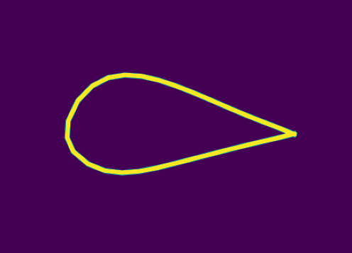
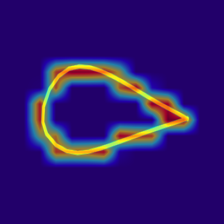
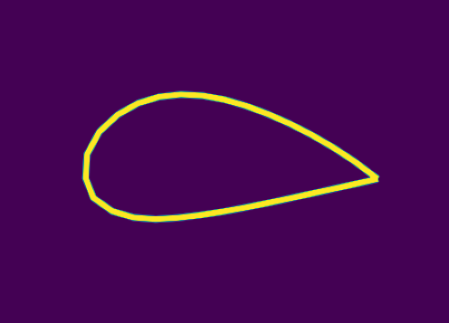
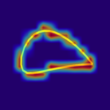

# Deep  Attention Network (DAN)

---

The repository mainly records how to use VIT to code the airfoil geometry and how to use the encoded information to reconstruct the flow field of the airfoil. 🖐

---

## 1、Airfoil   Visual   Transformer (VIT)  geometry encoding

---

1、timm_ V2.py is implemented using the timm visual algorithm function library. The traditional implementation method can refer to VIT_author.py file.

pytorch-image-models references：

author_home_page：https://github.com/rwightman

pytorch-image-models open source code：https://github.com/rwightman/pytorch-image-models

Zhi hu：[https://zhuanlan.zhihu.com/p/350837279](https://zhuanlan.zhihu.com/p/350837279)

2、Visual Transformer Code Reference for Attention Visualization：https://github.com/zuokuijun/Transformer-Explainability

3、 VIT_ Airfoil_ Encoder is a Pycharm engineering file that uses Transformer to encode geometric parameters for UIUC airfoil database

### How to use  ?👉👉👉👉👉

* `cd VIT_Airfoil_Encoder`

* run `python plot_airfoil.py` generate  airfoil  images. 
* run `python get_gray_images.py` generate airfoil gray images
* run `python get_airfoil_map.py` generate airfoil three channel  airfoil  heat-map  images
* run `python vit_explain.py`  get airfoil  geometry encoding information

## e1412 airfoil  attention  visualization

    
       

## naca4412 airfoil  attention  visualization

    
    

---

## 2、 Airfoil flow field prediction

* `cd VIT_flow_field_prediction`
* run `train.py` file to train DAN  
* run `mlp_test.py`  to get  DAN prediction  results  
